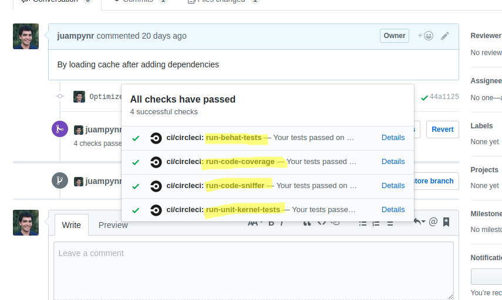

# Drupal 8 CI

[](https://circleci.com/gh/juampynr/drupal8ci)

This repository provides the foundation to implement [Continuous Integration](https://en.wikipedia.org/wiki/Continuous_integration) in a Drupal 8
project using [CircleCI](https://circleci.com/). After running the following script on a Drupal 8 project
and allowing CircleCI to access the repository, new pull requests will have the following checks:



For a working example, checkout https://github.com/juampynr/d8cidemo.

Here is a clip that shows how it works: https://www.youtube.com/watch?v=wd_5mX0x4K8.

## Contents

- A [Dockerfile](https://hub.docker.com/r/juampynr/drupal8ci/) that sets up an environment to run a Drupal 8 site.
- A custom demo module with [unit and kernel tests](web/modules/custom/demo_module/tests/src).
- Sample [Behat tests](tests).
- A CircleCI workflow that, when code is pushed to GitHub:
    * Runs unit and kernel tests.
    * Generates a test coverage report.
    * Tests the [Update Path](https://gist.github.com/juampynr/3c14c4267cc505720a0a4598e6a5ef8f) and runs Behat tests.
    * Checks that custom modules follow [Drupal's coding standards](https://www.drupal.org/docs/develop/standards) and best practices.

If you want to test an individual module instead of a Drupal project, see Andrew Berry's
[drupal_tests](https://github.com/deviantintegral/drupal_tests).

## Requirements

The scripts assume that the Drupal 8 project was created using [drupal-project](https://github.com/drupal-composer/drupal-project)
which sets a well known foundation for Drupal 8 projects. If your project's directory
structure differs from what _drupal-project_ sets up, you will need to
adjust the CircleCI scripts so they can run successfully.

## Installation

1. Make sure that you don't have changes pending to commit in your local environment.
2. Open a terminal and run the installer from the root of your project:
```bash
curl -L https://github.com/juampynr/drupal8ci/raw/master/setup.sh | bash
```
3. Review, commit and push the set of changes.
4. Sign up at [CircleCI](https://circleci.com/) and allow access to your project's repository.
5. Happy CI-ing! :-D. From now on every pull request that you create will have a link to the
   CircleCI dashboard where jobs will run and report their result back at the pull request.
   
### Setting up the update path
The Behat job requires a running Drupal 8 site. The repository contains the code, but for running
tests in a realistic environment we need:

* A recent copy of the production or development environment. If you have Drush site aliases, then
  add an SSH key to CircleCI so you can adjust the job to run `drush @my.alias sql-cli`.
  Alternatively upload a [sanitized](https://drushcommands.com/drush-8x/sql/sql-sanitize/) database dump somewhere (this project uses a Dropbox URL via an
  environment variable).
* The development or production environment's files directory. Again, if you have site aliases, then
  run `drush rsync @my.alias @self`. Alternatively, use the [Stage File Proxy](https://www.drupal.org/project/stage_file_proxy)
  module.

## Running CircleCI jobs locally

You can run the same jobs locally although there may be a few gotchas. Here is how to get started:

1. Install [CircleCI CLI](https://circleci.com/docs/2.0/local-jobs/#installing-the-cli-locally).
2. Rename `web/sites/default/settings.php` to something else. In theory this file
   should be skipped by CircleCI when it builds the image thanks to `.dockerignore` but
   this is currently not working.
3. The `.circleci/config.yml` defines a workflow with two jobs: `run-tests` and `run-update-path`.
   You can't run the workflow but you can run the jobs with the following commands:

```
circleci build --job run-update-path
circleci build --job run-unit-kernel-tests
```
