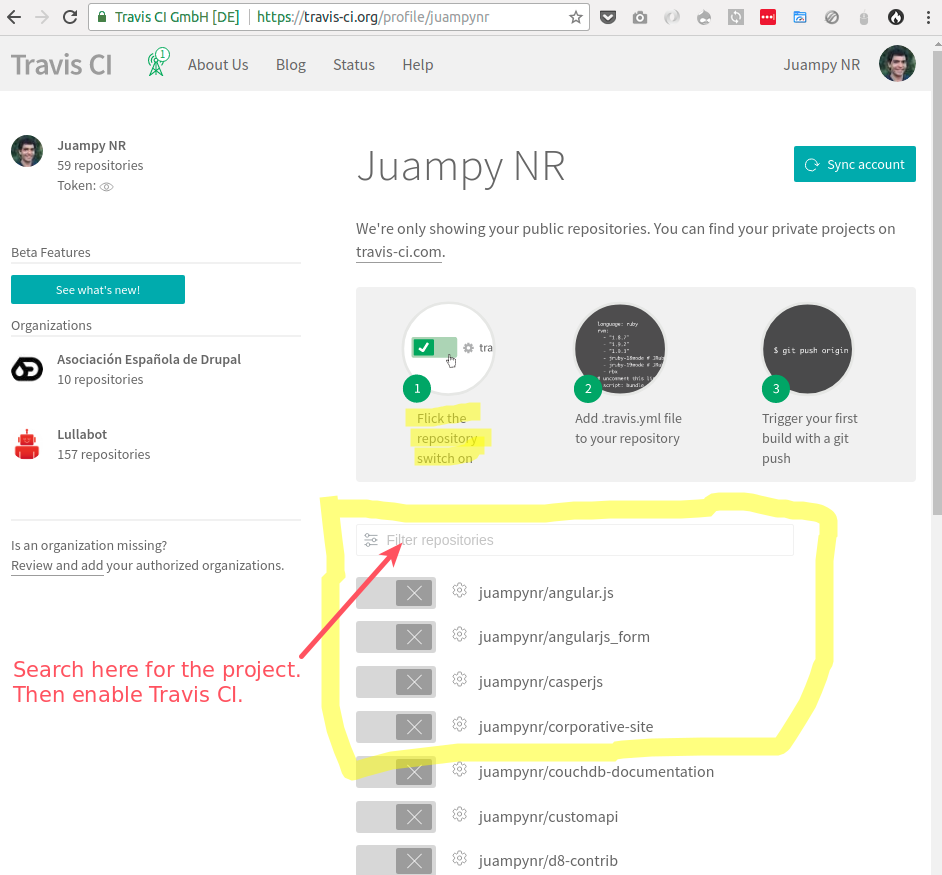
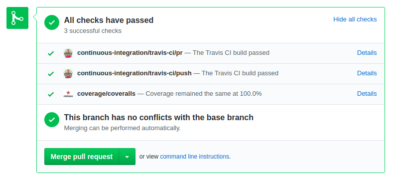

# Drupal 8 CI

[](https://circleci.com/gh/Lullabot/drupal8ci)

This repository provides the foundation to implement [Continuous Integration](https://en.wikipedia.org/wiki/Continuous_integration) in a Drupal 8
project using [CircleCI](https://circleci.com/) and [Travis](https://travis-ci.org) against a GitHub repository.

Simply run the installer (details below) and allow the CI provider that you chose to watch repository changes
to start building on every pull request.

For a working example, checkout https://github.com/juampynr/d8cidemo.

If you want to test an individual module instead of a Drupal project, see Andrew Berry's
[drupal_tests](https://github.com/deviantintegral/drupal_tests).

Here is a clip that shows how it works for CircleCI: https://www.youtube.com/watch?v=wd_5mX0x4K8.

## Requirements

The scripts assume that the Drupal 8 project was created using [drupal-project](https://github.com/drupal-composer/drupal-project)
which sets a well known foundation for Drupal 8 projects. If your project's directory
structure differs from what _drupal-project_ sets up, you will need to
adjust the CI jobs so they can run successfully.

## Installation

1. Make sure that you don't have changes pending to commit in your local environment.
2. Open a terminal and run the installer from the root of your project:
```bash
curl -L https://github.com/lullabot/drupal8ci/raw/master/setup.sh | bash
```
3. The installer adds the following files to your repository:
  - A custom demo module with [unit and kernel tests](web/modules/custom/demo_module/tests/src).
  - Sample [Behat tests](tests).
  - CircleCI and Travis CI implementations. At this point you should choose one. Currently
    the CircleCI implementation has more features and is more tested than the Travis CI
    implementation.

### [CircleCI](https://circleci.com)

If you chose this CI provider, you can delete the `.travis.yml` file and `.travis` directory.
Then commit and push the set of changes.

Sign up at [CircleCI](https://circleci.com/) and allow access to your project's repository.


Happy CI-ing! :-D. From now every time you create a pull request, CircleCI will run the
set of jobs and report their result like in the following screenshot:


For an overview of the CircleCI features, have a look at
[this article from the Lullabot blog](https://www.lullabot.com/articles/continuous-integration-drupal-8-circleci).

#### Using a custom Docker image

The [CircleCI configuration file](dist/.circleci/config.yml) uses a
[custom Docker image](https://hub.docker.com/r/juampynr/drupal8ci/) that extends from
the [official Drupal image](https://hub.docker.com/_/drupal/) and it is [hosted at
Docker Hub](https://hub.docker.com/r/juampynr/drupal8ci/). If this image
does not fit your project's architecture, then have a look at its
[Dockerfile](https://github.com/Lullabot/drupal8ci/blob/master/.circleci/images/primary/Dockerfile)
and consider [creating your own image](https://circleci.com/docs/2.0/custom-images/)
based out of it.
   
#### Setting up the update path

The Behat job requires a running Drupal 8 site. The repository contains the code, but for running
tests in a realistic environment you need:

* A recent copy of the production or development environment. If you have Drush site aliases, then
  at the CircleCI dashboard go to the project's permissions and add an SSH key
  so you can then adjust the job to run `drush @my.alias sql-cli`.
  Alternatively upload a [sanitized](https://drushcommands.com/drush-8x/sql/sql-sanitize/) database
  dump somewhere. For example [the demo project uses a Dropbox URL](https://github.com/juampynr/d8cidemo/blob/master/.circleci/config.yml#L70)
  via an environment variable.
* The development or production environment's files directory. Again, if you have site aliases, then
  run `drush rsync @my.alias @self`. Alternatively, use the [Stage File Proxy](https://www.drupal.org/project/stage_file_proxy)
  module.

#### Running CircleCI jobs locally

You can run the same jobs locally although there may be a few gotchas. Here is how to get started:

1. Install [CircleCI CLI](https://circleci.com/docs/2.0/local-jobs/#installing-the-cli-locally).
2. Rename `web/sites/default/settings.php` to something else. In theory this file
   should be skipped by CircleCI when it builds the image thanks to `.dockerignore` but
   this is currently not working.
3. The `.circleci/config.yml` defines a workflow with four jobs. You can't run the workflow but you
   can run the jobs by adding them as options to the command like in the following example:

```
circleci build --job run-unit-kernel-tests
```

### [Travis CI](https://travis-ci.org)

If you chose this CI provider, you can delete the `.circleci` directory.
Then commit and push the set of changes.

The Travis CI implementation currently runs unit and kernel tests, and checks Drupal's coding standards.
If you are well versed in Travis CI, please give us a hand and [contribute](dist/.travis.yml) so we can
reach feature parity with the CircleCI implementation.

#### Installation

1. Sign up at [Travis CI](https://travis-ci.com/) and allow access to your project's repository:



2. Happy CI-ing! :-D. From now on every pull request will trigger a build in Travis and its
progress will be visible like in the following screenshot:



